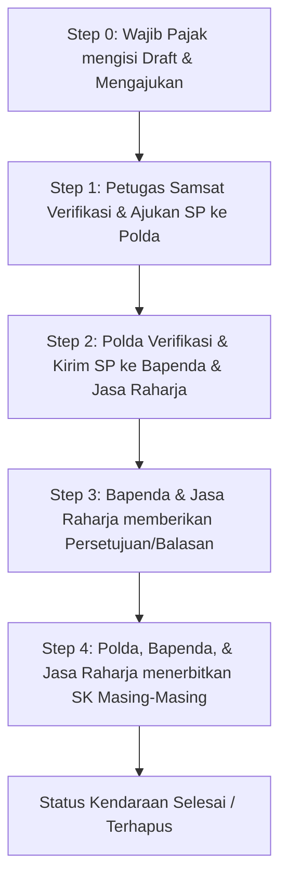

# Deskripsi Sistem Informasi Penghapusan Registrasi dan Identifikasi Kendaraan Bermotor (Hapus Regident) - Bapenda Jawa Tengah

Aplikasi ini merupakan platform digital terintegrasi yang dirancang untuk memfasilitasi dan mengotomatisasi proses bisnis **Penghapusan Registrasi dan Identifikasi Kendaraan Bermotor (Hapus Regident)** di lingkungan **Badan Pendapatan Daerah (Bapenda) Provinsi Jawa Tengah**. 

Sistem ini menghubungkan wajib pajak (warga/dealer) dengan berbagai instansi terkait (Samsat, Kepolisian Daerah/Polda, Bapenda, dan Jasa Raharja) untuk memastikan proses penghapusan data kendaraan dilakukan secara transparan, cepat, akuntabel, dan sesuai dengan regulasi yang berlaku.

---

## 1. Tujuan Utama Aplikasi
- **Digitalisasi Birokrasi**: Mengubah proses manual pengajuan penghapusan kendaraan bermotor menjadi alur kerja digital yang terpantau.
- **Kolaborasi Antar Instansi**: Mengintegrasikan koordinasi antara Samsat (Verifikator Awal), Polda (Regident Polantas), Bapenda (Pendapatan Daerah), dan Jasa Raharja (Asuransi/Sumbangan Wajib).
- **Transparansi Status**: Wajib Pajak dapat memantau secara real-time status pengajuan mereka melalui indikator progress dan histori log yang detail.
- **Keamanan Dokumen**: Penggunaan tanda tangan elektronik/digital, verifikasi berkas digital, dan pembatasan akses berdasarkan peran (Role-Based Access Control - RBAC).

---

## 2. Arsitektur & Teknologi Utama
Sistem ini dibangun menggunakan ekosistem teknologi modern berbasis PHP:
- **Framework Utama**: Laravel (MVC Architecture)
- **Database**: Relasional (MySQL/PostgreSQL) dengan dukungan SQLite untuk pengujian.
- **Frontend**: HTML5, Vanilla CSS (kustomisasi premium), TailwindCSS, dan JavaScript (Vanilla JS untuk manajemen state & auto-save).
- **PDF Engine**: Barryvdh DomPDF untuk pembuatan Surat Pengajuan (SP) dan Surat Keputusan (SK) secara dinamis.
- **Media Management**: Spatie Media Library untuk pengelolaan dokumen lampiran (BPKB, STNK, KTP, dll.).
- **Otentikasi & Keamanan**: Laravel Fortify/Breeze dengan integrasi hak akses menggunakan Spatie Permission.

---

## 3. Alur Kerja (Workflow) Sistem
Proses penghapusan kendaraan dibagi menjadi beberapa tahap utama (Step 0 hingga Step 4):

### Penjelasan Detail Step Progress:
1. **Step 0 (Persiapan & Pengajuan)**: Wajib Pajak mengunggah berkas identitas dan kendaraan. Status awal adalah **Draft** atau **Pengajuan**.
2. **Step 1 (Verifikasi Samsat)**: Petugas Samsat setempat memeriksa kelengkapan fisik dan administrasi berkas. Jika sesuai, Samsat menerbitkan **Surat Pengajuan (SP) ke Polda**.
3. **Step 2 (Rekomendasi Polda)**: Polda memeriksa status kriminalitas atau blokir kendaraan. Jika aman, Polda mengirimkan SP persetujuan ke Bapenda dan Jasa Raharja untuk meminta rekomendasi fiskal.
4. **Step 3 (Verifikasi Keuangan)**: Bapenda memeriksa tunggakan pajak (PKB), dan Jasa Raharja memeriksa tunggakan SWDKLLJ. Kedua instansi memberikan tanda terima/balasan persetujuan.
5. **Step 4 (Penerbitan SK)**: Setelah semua rekomendasi lengkap, Polda, Bapenda, dan Jasa Raharja masing-masing mengunggah **Surat Keputusan (SK)** resmi. Setelah ketiga SK diunggah, status kendaraan berubah menjadi **Selesai**.

---

## 4. Peran Pengguna (Role-Based Access Control)
Sistem membatasi hak akses secara ketat melalui pembagian modul:

| Role | Deskripsi Singkat | Izin Utama (Permissions) |
|---|---|---|
| **Wajib Pajak (Warga/Dealer)** | Pemilik kendaraan yang mengajukan penghapusan. | `view_own_pengajuan`, `create_pengajuan`, `edit_own_kendaraan`, `create_own_log` |
| **Petugas Samsat / Admin** | Verifikator awal berkas pengajuan di tingkat cabang. | `view_all_pengajuan`, `update_status_kendaraan`, `create_admin_log`, `view_all_pengajuan_detail` |
| **Polda / Regident** | Penilai keabsahan hukum kendaraan dan penerbit SK Polda. | Mengelola Surat Pengajuan (SP) tingkat Polda, verifikasi status Regident, menerbitkan SK Polda |
| **Bapenda & Jasa Raharja** | Pemeriksa kewajiban pajak/asuransi dan penerbit SK instansi terkait. | Memberikan persetujuan SP instansi, mengunggah SK Bapenda/JR |
| **Superadmin / IT Support** | Administrator sistem utama untuk pemeliharaan data. | `manage_rbac`, `view_users`, `create_users`, `edit_users`, `delete_users` |

---

## 5. Model Data & Struktur Database Utama
- **`User`**: Menyimpan kredensial pengguna, profil, jenis instansi, serta relasi ke `Role` dan `Cabang`.
- **`Pengajuan`**: Bundel pengajuan utama yang dibuat oleh user. Satu pengajuan dapat menampung banyak kendaraan (multi-kendaraan). Memiliki nomor pengajuan unik (`PJN-yymm-xxxx`).
- **`Kendaraan`**: Menyimpan detail spesifikasi kendaraan (NRKB, No. Rangka, No. Mesin, Warna TNKB, dll.) serta status spesifik masing-masing kendaraan (`draft`, `pengajuan`, `diproses`, `selesai`, `ditolak`).
- **`Pemilik`**: Menyimpan informasi pemilik kendaraan (Nama, NIK, Alamat, Kontak).
- **`SuratPengajuan (SP)`**: Dokumen surat pengajuan antar-instansi dengan status persetujuan terdistribusi (`persetujuan_unit_kerja`).
- **`SuratKeputusan (SK)`**: Dokumen keputusan akhir yang diterbitkan oleh masing-masing unit kerja (Polda, Bapenda, Jasa Raharja).
- **`KendaraanLog`**: Histori lengkap aktivitas pengajuan, catatan revisi, dan komunikasi antara Wajib Pajak dengan petugas verifikator.
